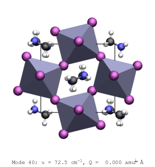

## Welcome to the Skelton research group website
------------------------------------------------

 

We are a theory group based in the School of Chemistry at the University of Manchester, UK.

We use a wide variety of theoretical modelling techniques to study materials ranging from inorganic semiconductors to molecular crystals and "hybrid" inorganic/organic systems.

We are particularly interested in the structural dynamics of solids and their effect on material properties.
Our work in this area includes understanding the fundamentals of heat transport, devising new engineering strategies to control it, and predicting the structural, mechanical and electrical properties of materials at elevated temperature.
We have a long-standing interest in improving materials for energy applications, including thermoelectric power generation and, more recently, photovoltaics and battery materials.

Our work applies and extends established theories to address new problems, with strong focus on making useful methods available to the community through open-source software and on strengthening links between theory and experiment.
We regularly work with experimental groups to validate theoretical models and to help get the best insight from measurements.

More information about current research projects and the team behind them can be found on the [Research](./research.html) and [People](./people.html) pages.
We also have a list of the group [Publications](./publications.html) and the open-source [Software](./software.html) we maintain.

To find out more about us, or if you are interested in joining or collaborating with us, current opportunities are listed on the [Opportunities page](./opportunities) and our contact details are [here](./contact.html).

 

<figure>
    

      
      
  

    <figcaption>
        Lattice vibrations (phonon modes) in the hybrid halide perovskite methylammonium lead iodide (CH3NH3)PbI3 (MAPbI3).
        In this material, the strong coupling between the motion of the PbI3- cage and the MA+ cation seen here suppresses the thermal conductivity, and this is an important contributor to its remarkable performance as an absorber material in hybrid perovskite solar cells.
    </figcaption>
</figure>

 
