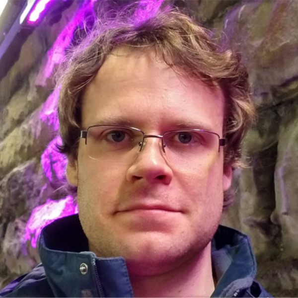

## Meet the group
----------

 

### Dr Jonathan Skelton (PI)
-----------

Jonathan joined the University of Manchester in 2018 on a Presidential Fellowship.
He was previously a post-doctoral researcher at the University of Bath with Profs. Aron Walsh, Steve Parker and Paul Raithby.
He completed his PhD in Computational Chemistry with Prof. Stephen Elliott at the University of Cambridge in 2013.

He is interested in using modelling to understand how materials with unusual properties "work", which often leads to large and/or challenging calculations.
Fortunately, he enjoys problem solving and programming, which helps a lot.
Although technically a theorist, he is interested in spectroscopy and occasionally helps experimental collaborators with measurements.

Jonathan's teaching includes courses on functional molecular materials, phonon theory and applications, and thermodynamics.
He also helps design and run several comp. chem. experiments for the 3rd-year undergraduate Chemistry labs.

On the (currently rare) occasions when he is not buried in research and teaching, Jonathan also enjoys cooking, photography and gardening.

 
